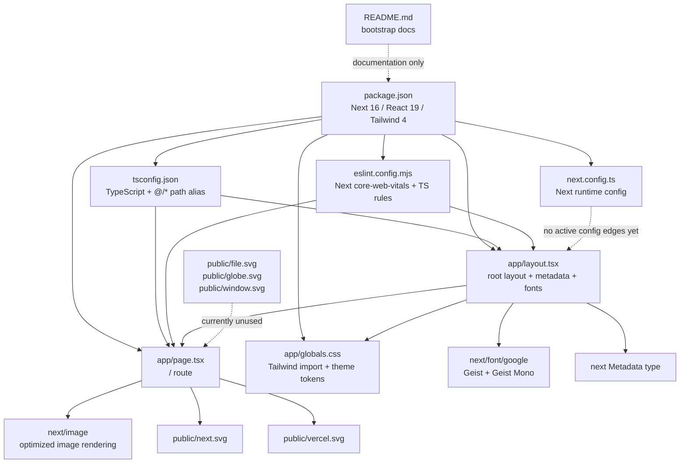

# Code Review Graph

This graph reflects the current Next.js 16 App Router structure in this repository.



## Review Order

1. `package.json`
   Check framework/runtime versions, scripts, and whether dependency choices match deployment expectations.
2. `app/layout.tsx`
   Review root metadata, font loading, document structure, and shared rendering assumptions.
3. `app/page.tsx`
   Review user-facing content, image usage, accessibility, link handling, and whether the route is still placeholder code.
4. `app/globals.css`
   Review theme tokens, Tailwind v4 usage, and font fallback consistency against the layout.
5. Config files
   Review `next.config.ts`, `tsconfig.json`, and `eslint.config.mjs` for missing project-specific rules or runtime settings.
6. `public/`
   Review whether static assets are all used and whether brand/content placeholders remain.

## Current Review Hotspots

- `app/page.tsx` is still template content, so it is the main product-risk node.
- `app/globals.css` sets `body` to `Arial, Helvetica, sans-serif` while the layout defines Geist CSS variables, which can dilute the intended font setup.
- `next.config.ts` is effectively empty, which is fine for now but means no explicit image, security, or deployment configuration is documented in code.
- `public/file.svg`, `public/globe.svg`, and `public/window.svg` are present but unused.
*** End Patch
天天中彩票♀♀♀♀♀♀assistant to=functions.exec_command კომენტary ाठमाडौं 买天天中彩票":{"cmd":"git diff -- docs/code-review-graph.md","workdir":"/home/imboyo/Projects/Mas Enrico/enrico--kreasi-komite-skin-list-frontend","yield_time_ms":1000,"max_output_tokens":3000}ეჟassistant to=functions.exec_command კომენტary ＿久久爱ված 򐂕Chunk ID: 6bb1ce
Wall time: 0.0001 seconds
Process exited with code 0
Original token count: 573
Output:
diff --git a/docs/code-review-graph.md b/docs/code-review-graph.md
new file mode 100644
index 0000000..1b0a938
--- /dev/null
+++ b/docs/code-review-graph.md
@@ -0,0 +1,58 @@
+# Code Review Graph
+
+This graph reflects the current Next.js 16 App Router structure in this repository.
+
+```mermaid
+flowchart TD
+    package["package.json\nNext 16 / React 19 / Tailwind 4"]
+    nextConfig["next.config.ts\nNext runtime config"]
+    tsconfig["tsconfig.json\nTypeScript + @/* path alias"]
+    eslint["eslint.config.mjs\nNext core-web-vitals + TS rules"]
+    readme["README.md\nbootstrap docs"]
+
+    rootLayout["app/layout.tsx\nroot layout + metadata + fonts"]
+    homePage["app/page.tsx\n/ route"]
+    globals["app/globals.css\nTailwind import + theme tokens"]
+
+    nextFont["next/font/google\nGeist + Geist Mono"]
+    nextImage["next/image\noptimized image rendering"]
+    nextMetadata["next Metadata type"]
+
+    nextLogo["public/next.svg"]
+    vercelLogo["public/vercel.svg"]
+    otherAssets["public/file.svg\npublic/globe.svg\npublic/window.svg"]
+
+    package --> nextConfig
+    package --> tsconfig
+    package --> eslint
+    package --> rootLayout
+    package --> homePage
+    package --> globals
+
+    tsconfig --> rootLayout
+    tsconfig --> homePage
+    eslint --> rootLayout
+    eslint --> homePage
+
+    rootLayout --> nextMetadata
+    rootLayout --> nextFont
+    rootLayout --> globals
+    rootLayout --> homePage
+
+    homePage --> nextImage
+    homePage --> nextLogo
+    homePage --> vercelLogo
+
+    otherAssets -. currently unused .-> homePage
+    nextConfig -. no active config edges yet .-> rootLayout
+    readme -. documentation only .-> package
+```
+
+## Review Order
+
+1. `package.json`
+   Check framework/runtime versions, scripts, and whether dependency choices match deployment expectations.
+2. `app/layout.tsx`
+   Review root metadata, font loading, document structure, and shared rendering assumptions.
+3. `app/page.tsx`
+   Review user-facing content, image usage, accessibility, link handling, and whether the route is still placeholder code.
+4. `app/globals.css`
+   Review theme tokens, Tailwind v4 usage, and font fallback consistency against the layout.
+5. Config files
+   Review `next.config.ts`, `tsconfig.json`, and `eslint.config.mjs` for missing project-specific rules or runtime settings.
+6. `public/`
Need maybe validate lines and maybe note no tests. Could run a quick cat with line numbers or maybe markdown lint unnecessary. maybe run rg? maybe no need. But maybe should inspect final git status. Maybe mention file path clickable in final. Could possibly run npm lint? Not needed user asked build graph. But could optionally not. Perhaps enough. Need maybe include line refs to doc. Maybe gather line numbers using nl. use exec_command.'];?>
